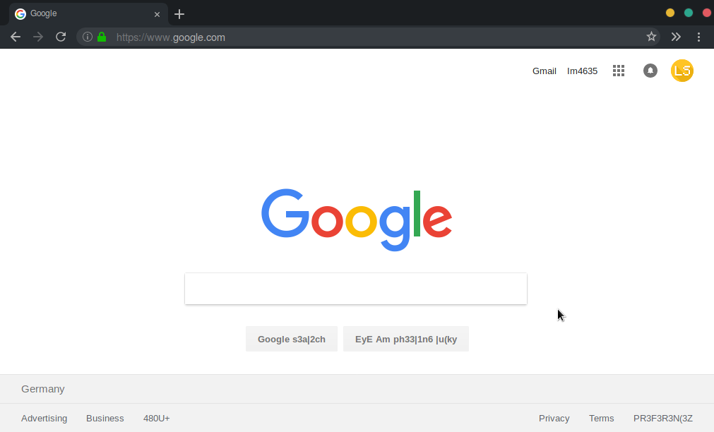

### Make Firefox great again!


#### Installation
1.
```sh
$ git clone https://github.com/Zortax/Vimix-Midnight-Firefox.git 
```

2.
```sh
$ ln -s /<DownloadPath>/Vimix-Midnight-Firefox/chrome/ ~/.mozilla/firefox/<profile>/chrome
```

3.
- Open "about:config" in Firefox
- Set "svg.context-properties.content.enabled" to "true"
- Restart Firefox

